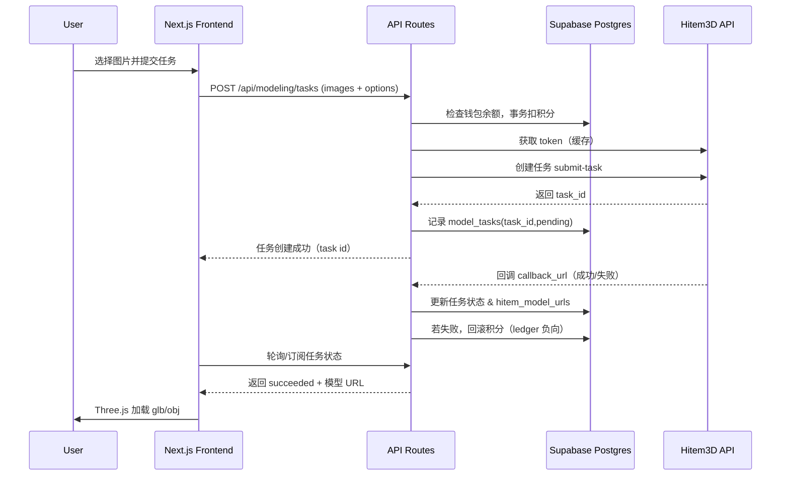
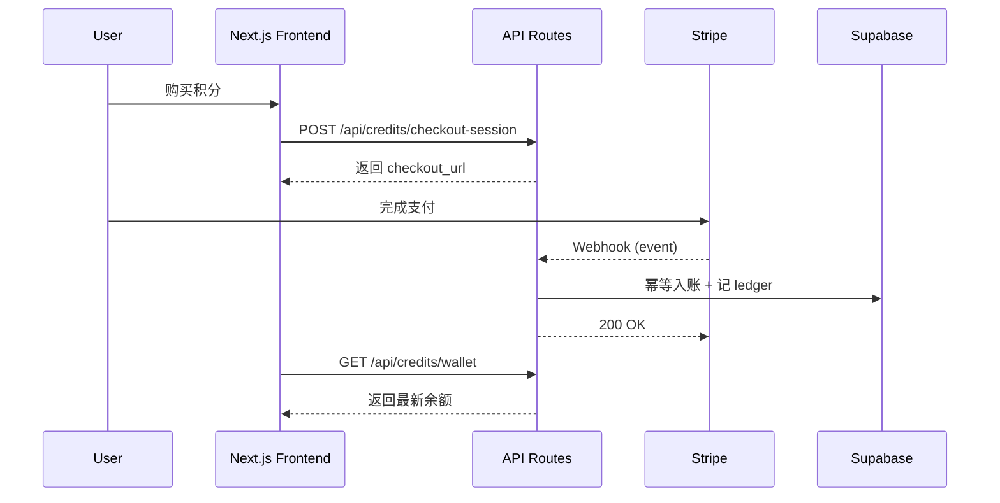

# 关键流程（Sequence Diagrams）

```mermaid
sequenceDiagram
  participant U as User
  participant FE as Next.js Frontend
  participant BE as API Routes
  participant DB as Supabase Postgres
  participant H as Hitem3D API

  U->>FE: 选择图片并提交任务
  FE->>BE: POST /api/modeling/tasks (images + options)
  BE->>DB: 检查钱包余额，事务扣积分
  BE->>H: 获取 token（缓存）
  BE->>H: 创建任务 submit-task
  H-->>BE: 返回 task_id
  BE->>DB: 记录 model_tasks(task_id,pending)
  BE-->>FE: 任务创建成功（task id）

  H-->>BE: 回调 callback_url（成功/失败）
  BE->>DB: 更新任务状态 & hitem_model_urls
  BE->>DB: 若失败，回滚积分（ledger 负向）
  FE->>BE: 轮询/订阅任务状态
  BE-->>FE: 返回 succeeded + 模型 URL
  FE->>U: Three.js 加载 glb/obj
```

```mermaid
sequenceDiagram
  participant U as User
  participant FE as Next.js Frontend
  participant BE as API Routes
  participant Stripe as Stripe
  participant DB as Supabase

  U->>FE: 购买积分
  FE->>BE: POST /api/credits/checkout-session
  BE-->>FE: 返回 checkout_url
  U->>Stripe: 完成支付
  Stripe-->>BE: Webhook (event)
  BE->>DB: 幂等入账 + 记 ledger
  BE-->>Stripe: 200 OK
  FE->>BE: GET /api/credits/wallet
  BE-->>FE: 返回最新余额
```

